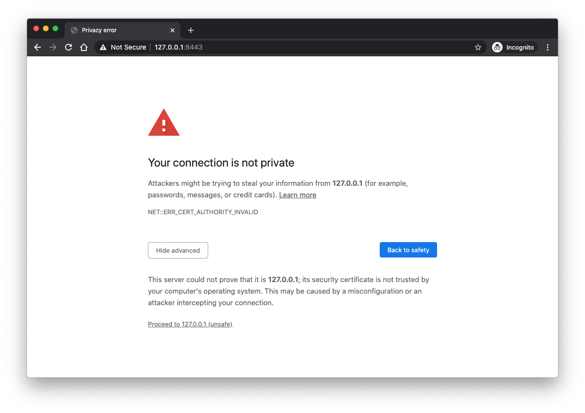
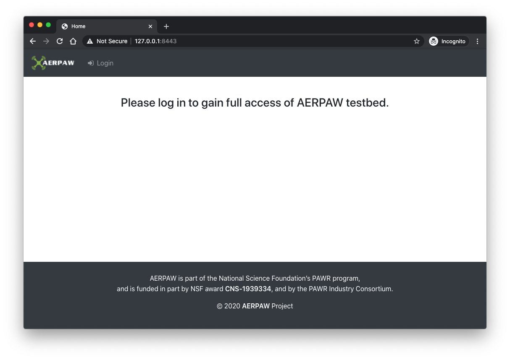
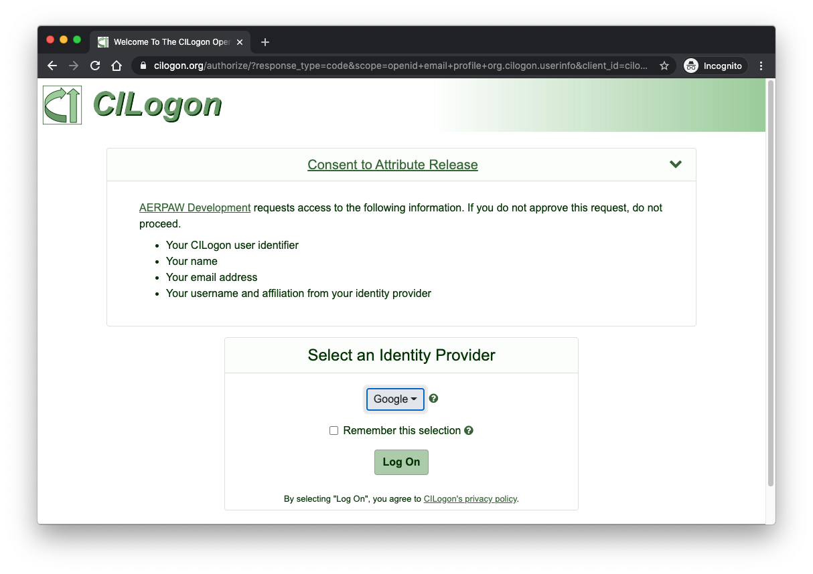
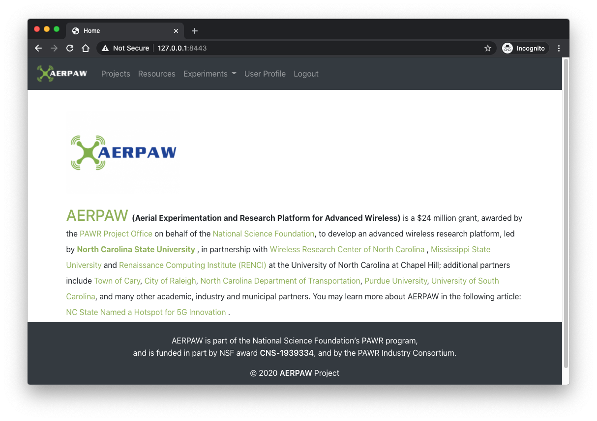

# AERPAW Portal

**THIS IS A WORK IN PROGRESS**

Initial development framework for AERPAW Portal

- Web framework ([Django](https://docs.djangoproject.com/en/3.1/))
- Web server gateway interface ([uWSGI](https://uwsgi-docs.readthedocs.io/en/latest/))
- Web server / reverse proxy ([Nginx](https://hub.docker.com/_/nginx/))
- Database ([PostgreSQL](https://www.postgresql.org/docs/12/index.html))
- OIDC Authentication ([CILogon](https://www.cilogon.org/oidc))
- OpenSSL development certificates ([OpenSSL](https://www.openssl.org))

## Table of Contents

- [How to Contribute](#contrib)
- [Setting up your Development Environment](#setup)
- [Running the Development Environment](#run-dev)
- [Running everything in Docker](#run-in-docker)
- [Cleaning it all up](#cleanup)
- [User model](#user-model)

## <a name="contrib"></a>How to Contribute

If you wish to contribute to the AERPAW Portal please follow a few basic guidelines.

1. Ensure you're able to run the existing code in your own [development environment](#setup).
2. Create a descriptive [GitHub issue](https://github.com/AERPAW-Platform-Control/aerpaw-portal/issues) that outlines what feature you plan to contribute.
3. Clone the repository, and start from the most recent version of the [develop branch](https://github.com/AERPAW-Platform-Control/aerpaw-portal/tree/develop).
4. Name your branch using the Github issue number as a prefix along with a brief name that corresponds to your feature (e.g., `8-how-to-contribute`).
5. Once satisfied with your completed and tested work, submit a [pull request](https://github.com/AERPAW-Platform-Control/aerpaw-portal/pulls) against the **develop** branch so that your code can be reviewed by the team.

Notes:

- Do not create a pull request against the **master** branch. The **master** branch is considered the production branch and must always remain stable. The **master** branch is periodically updated from the contents of the **develop** branch at the conclusion of a development cycle.
- Do not put any content (css, js, images, etc.) in the main `static` directory, instead create a directory named `static` in your app that can be imported into the main `static` directory using the `manage.py collectstatic` call.
- Use clear and concise naming conventions for apps, classes, functions, variables, etc. Ideally others will be able to reuse your work, and the more clear and concise your code is, the easier it is to reuse it.
- Include easy to understand documentation and complete unit/functional tests for each new feature being introduced to the project. ([pytest](https://docs.pytest.org/en/latest/) is the recommended framework to use for testing).


## <a name="setup"></a>Setting up your Development Environment

Requirements

- Python 3 (with Pip 3 and virtualenv)
- Docker
- Docker Compose

The AERPAW Portal is a Django based application, and the portal code itself should be run from your local machine for development. Other aspects of the project are expected to run in Docker (Nginx, database, etc.) and the included configuration files may need to be updated to suit your particular setup. My preferred Python virtual environment is [virtualenv](https://virtualenv.pypa.io/en/latest/), so the documentation herein will make use of it.

## <a name="run-dev"></a>Running the Development Environment

### Configuration

Copy the `env.template` as `.env` and update settings `CILOGON_CLIENT_ID` and `CILOGON_CLIENT_SECRET` with the information as provided by CILogon during client registration.

**Client Registration** 

- To get started, register your client at [https://cilogon.org/oauth2/register](https://cilogon.org/oauth2/register) and wait for notice of approval. Please register your callback URLs on that page with care. They are the only callback URLs that may be used by your client unless you later contact help@cilogon.org and request a change to your registration.
- Upon completion the user will be issued a `CILOGON_CLIENT_ID` and `CILOGON_CLIENT_SECRET`.


```sh
# Environment settings for both Django and docker-compose
...
# OIDC CILogon (django)
# callback url
export OIDC_RP_CALLBACK='https://127.0.0.1:8443/oidc/callback/'
# client id and client secret
export OIDC_RP_CLIENT_ID=''         # <-- replace with your client id
export OIDC_RP_CLIENT_SECRET=''     # <-- replace with your client secret
# oidc scopes
export OIDC_RP_SCOPES="openid email profile org.cilogon.userinfo"
...
```

- The rest of the values in the `.env` file should have sane defaults for running locally at [https://127.0.0.1:8443](). If you prefer to run your application at a different domain you will need to update the `.env` accordingly.

### Docker containers

The `docker-compose.yml` file at the top level of the repository is meant for **development** use. Other compose definitions can be found in the `compose` directory. The development compose file will not start the main Django application as it's meant to be run directly from the host, and only runs the database and nginx containers.

```
docker-compose pull
docker-compose up -d
```

Verify that the containers are running as expected. You should observe two running containers.

```
$ docker-compose ps
    Name                  Command               State                      Ports
---------------------------------------------------------------------------------------------------
aerpaw-db      docker-entrypoint.sh postgres    Up      0.0.0.0:5432->5432/tcp
aerpaw-nginx   /docker-entrypoint.sh ngin ...   Up      0.0.0.0:8443->443/tcp, 0.0.0.0:8080->80/tcp
```

Verify that the database is ready to accept connections.

```
$ docker-compose logs database
Attaching to aerpaw-db
...
aerpaw-db   | PostgreSQL init process complete; ready for start up.
aerpaw-db   |
aerpaw-db   | 2020-09-29 16:09:17.018 UTC [1] LOG:  starting PostgreSQL 12.4 (Debian 12.4-1.pgdg100+1) on x86_64-pc-linux-gnu, compiled by gcc (Debian 8.3.0-6) 8.3.0, 64-bit
aerpaw-db   | 2020-09-29 16:09:17.019 UTC [1] LOG:  listening on IPv4 address "0.0.0.0", port 5432
aerpaw-db   | 2020-09-29 16:09:17.019 UTC [1] LOG:  listening on IPv6 address "::", port 5432
aerpaw-db   | 2020-09-29 16:09:17.021 UTC [1] LOG:  listening on Unix socket "/var/run/postgresql/.s.PGSQL.5432"
aerpaw-db   | 2020-09-29 16:09:17.080 UTC [57] LOG:  database system was shut down at 2020-09-29 16:09:16 UTC
aerpaw-db   | 2020-09-29 16:09:17.104 UTC [1] LOG:  database system is ready to accept connections
```

### Django

Create a virtual environment at the top level of the repository, activate it, and pip install the requirements file

```console
virtualenv -p $PATH_TO_PYTHON3 venv
source venv/bin/activate
pip install -r requirements.txt
```

Install Aerpaw Gateway Client
```console
pip install git+https://github.com/AERPAW-Platform-Control/aerpaw-gateway-client.git
```

Once completed you should be ready to run the script that launches the Django application using uWSGI

```console
UWSGI_UID=$(id -u) UWSGI_GID=$(id -g) ./run_uwsgi.sh
```

- NOTE: parameters for the User's UID and GID are passed to uWSGI for it to be able to run it's workers as that user.

Navigate to [https://127.0.0.1:8443/](https://127.0.0.1:8443/) in your browser (may encounter a security warning due to using a self signed certificate) 



Once on the main page you should observe the following:



Follow the [Log In]() link to the `login.html` page, and proceed to CILogon



Choose your identity provider from the dropdown and authenticate. Upon successful authentication you should see a page populated with your CILogon Claims as provided by your identity provider.



## <a name="run-in-docker"></a>Running everything in Docker

### Configuration

Some configuration is required prior to running the production environment.

- copy the `env.template` file as `.env`
    - populate the `.env` file with values for `OIDC_RP_CLIENT_ID` and `OIDC_RP_CLIENT_SECRET` (all other values should have sane defaults, but may need to be adjusted based on your local setup)
    - update value `export POSTGRES_HOST=database`
- copy the `nginx/production.conf` file as `nginx/default.conf`
- in the `uwsgi.ini` file

    ```
    [uwsgi]
    ...
    # use for development
    ;socket = :8000
    
    # use for production
    uwsgi-socket = ./base.sock
    chmod-socket = 666
    ```
 

### Docker containers

Copy the `compose/production-compose.yml` file as `docker-compose.yml`

```
docker-compose pull
docker-compose build
UWSGI_UID=$(id -u) UWSGI_GID=$(id -g) docker-compose up -d
```

Verify that the containers are running as expected. You should observe three running containers (only ports 8080 and 8443 are exposed to the outside, all other connections occur on a local subnet).

```
$ docker-compose ps
    Name                   Command               State                      Ports
----------------------------------------------------------------------------------------------------
aerpaw-db       docker-entrypoint.sh postgres    Up      5432/tcp
aerpaw-nginx    /docker-entrypoint.sh ngin ...   Up      0.0.0.0:8443->443/tcp, 0.0.0.0:8080->80/tcp
aerpaw-portal   /code/docker-entrypoint.sh       Up
```

Once the django container completes building it should present something similar to

```
$ docker-compose logs django
Attaching to aerpaw-portal
...
aerpaw-portal | mapped 145840 bytes (142 KB) for 1 cores
aerpaw-portal | *** Operational MODE: single process ***
aerpaw-portal | WSGI app 0 (mountpoint='') ready in 3 seconds on interpreter 0x5632c13d44b0 pid: 668 (default app)
aerpaw-portal | *** uWSGI is running in multiple interpreter mode ***
aerpaw-portal | spawned uWSGI master process (pid: 668)
aerpaw-portal | spawned uWSGI worker 1 (pid: 670, cores: 1)
```

Navigate to [https://127.0.0.1:8443/](https://127.0.0.1:8443/) in your browser (may encounter a security warning due to using a self signed certificate) and you should observe the following:


## <a name="cleanup"></a>Cleaning it all up

### Docker

Use `docker-compose` to stop and remove your containers when finished

```
docker-compose stop
docker-compose rm -fv
```

### Django

The locally running Django application can be terminated by issuing a `ctrl-c` in the terminal it is running in (unless you've backgrounded the process in which case you'll need to terminate it by PID instead)

```console
# find the process associated with the bash ./run_uwsgi.sh call
$ ps -a
  PID TTY           TIME CMD
...
41712 ttys000    0:00.01 bash ./run_uwsgi.sh
41725 ttys000    0:00.28 uwsgi --uid 503 --gid 20 --virtualenv ./venv --ini uwsgi.ini
41727 ttys000    0:00.33 uwsgi --uid 503 --gid 20 --virtualenv ./venv --ini uwsgi.ini
...
41841 ttys001    0:00.00 ps -a

# terminate it along with the uswgi processes it spawned
$ kill -9 41712 41725 41727
```
# or kill it more conviniently
$ kill -INT `cat /tmp/project-master.pid`
# or 
$ uwsgi --stop /tmp/project-master.pid


### Directories

Some directories are created and populated during the running of the application. These can be left in tact on your local system, or removed prior to the next restart of the application if you do not wish to persist prior data.

- `pg_data/` - contents of the database and shared with the Docker database container
- `accounts/migrations/` - generated database migrations that map the Python objects to the database tables (as more Django apps are added, more migrations directories will begin to appear)
- `static/` and `media/` - the contents of these directories depend on the css, js, and additional static artifacts required to run the site and are expected to evolve over time

## <a name="user-model"></a>User model

The `AerpawUser` custom user model extends the base user model with OIDC Claims discovered on login. 

Base User objects have the following fields:

- **username** - Required. 150 characters or fewer. Usernames may contain alphanumeric, `_`, `@`, `+`, `.` and `-` characters
- **first\_name** - Optional (`blank=True`). 150 characters or fewer
- **last\_name** - Optional (`blank=True`). 150 characters or fewer
- **email** - Optional (`blank=True`). Email address
- **password** - Required. A hash of, and metadata about, the password
- **groups** - Many-to-many relationship to Group
- **user\_permissions** - Many-to-many relationship to Permission
- **is\_staff** - Boolean. Designates whether this user can access the admin site
- **is\_active** - Boolean. Designates whether this user account should be considered active
- **is\_superuser** - Boolean. Designates that this user has all permissions without explicitly assigning them
- **last\_login** - A datetime of the user’s last login
- **date\_joined** - A datetime designating when the account was created

#Create super user
$python manage.py createsuperuser


Ref: [https://docs.djangoproject.com/en/3.1/ref/contrib/auth/](https://docs.djangoproject.com/en/3.1/ref/contrib/auth/)

     
